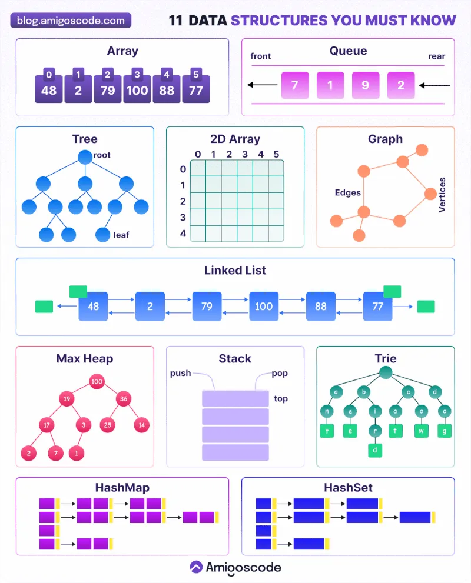

# Contenido Offtopic

## Índice

- [Artículos de interés](#artículos-de-interés)
- [Memes para coders](#memes-para-coders)

## Artículos de interés

- [11 Estructuras de datos que todo desarrollador debe conocer](https://blog.amigoscode.com/p/11-data-structures-every-developer)

## Memes para coders
